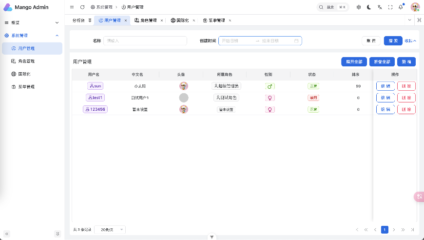
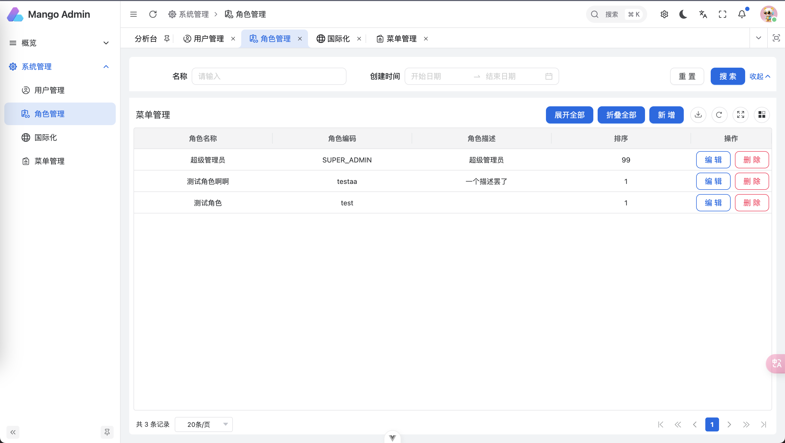
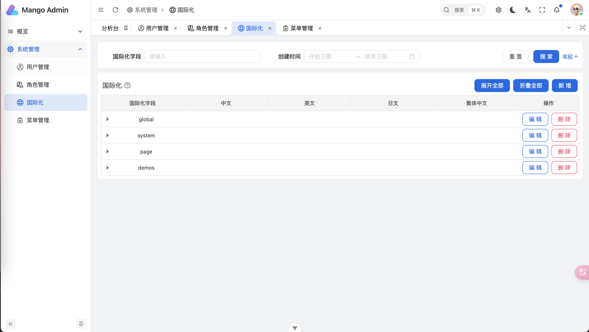
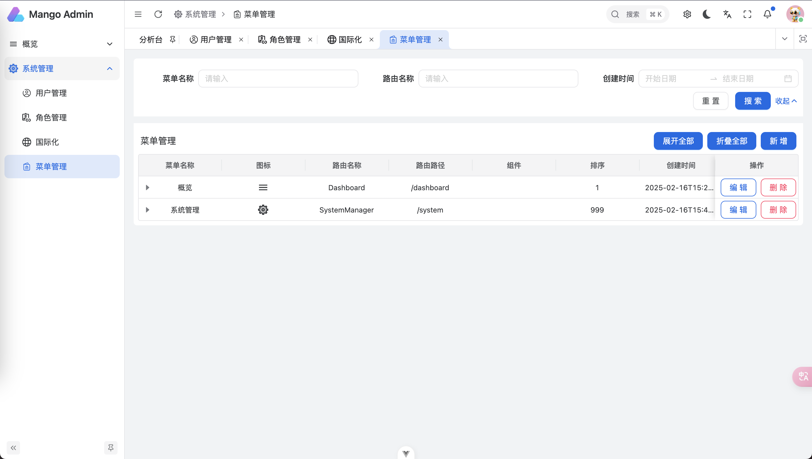

<div align="center"> <a href="https://github.com/anncwb/vue-vben-admin">  </a> <br> <br>

[](LICENSE)

<h1>Mango Admin</h1>
</div>


## 简介

Mango Admin 是一个前端基于 [Vben Admin](https://www.vben.pro/) 二次开发，后端基于 [Mango](http://sunshinego.top/mango-docs/) 的全栈后台应用，适合学习全栈开发的同学参考学习。


- 🦊 前端技术栈： [Vue3.5](https://cn.vuejs.org/)、[Ant Design Vue](https://www.antdv.com/)、[UnoCSS](https://unocss.dev/)、[Pinia](https://pinia.vuejs.org/)


- 🦊 后端技术栈： [Mango](http://sunshinego.top/mango-docs/)、Mysql、Prisma
- 🦊 系统借鉴了[vue3-admin](https://github.com/baiwumm/vue3-admin)

## 功能
1. 国际化
2. RBAC权限控制
3. 后端支持打包为可执行文件

## 运行
1. 创建Mysql数据库
```bash
// 将server下的.env.template复制一份出来，重命名为.env
// 将里面的数据库改为自己的
bun run db:dev  // 迁移
```
2. 项目拉取
```bash
git clone https://github.com/sunshinego12138/mango-admin.git
cd mango-admin
// 进入前端
cd web
// 进入后端
cd server
```
3. 安装依赖
```bash
bun install
```

## 项目预览



